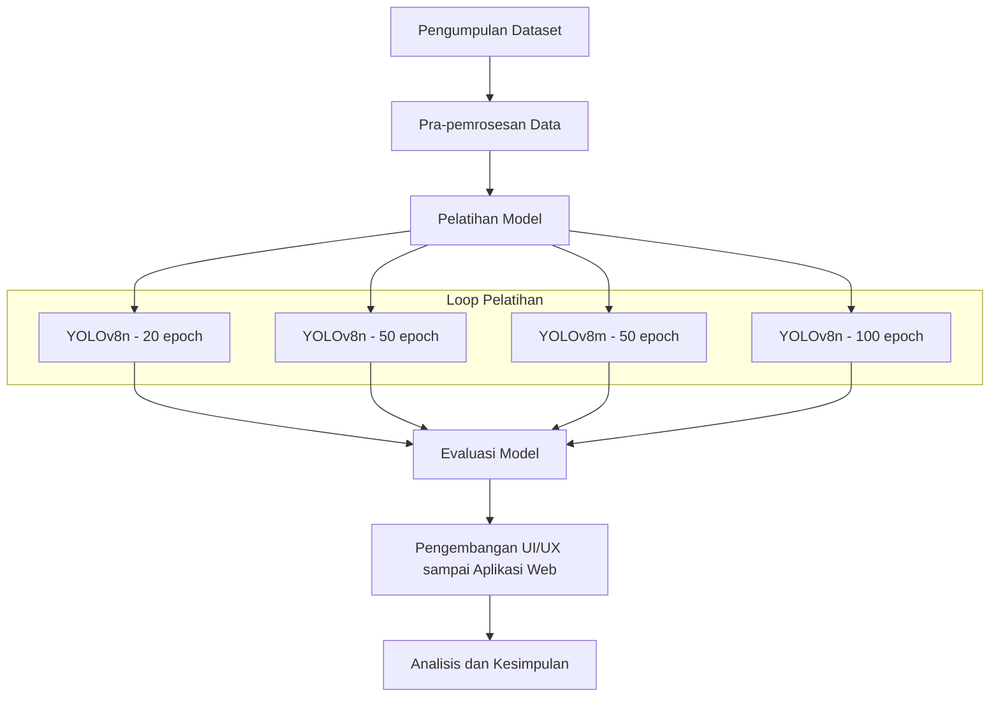

```mermaid
graph TD
    A[Pengumpulan Dataset] --> B[Pra-pemrosesan Data]
    B --> C[Pelatihan Model]

    subgraph LP["Loop Pelatihan"]
        direction TB
        C1[YOLOv8n - 20 epoch]
        C2[YOLOv8n - 50 epoch]
        C3[YOLOv8m - 50 epoch]
        C4[YOLOv8n - 100 epoch]
    end

    C --> C1
    C --> C2
    C --> C3
    C --> C4

    C1 --> D[Evaluasi Model]
    C2 --> D
    C3 --> D
    C4 --> D

    D --> E[Pengembangan UI/UX sampai Aplikasi Web]
    E --> F[Analisis dan Kesimpulan]
```